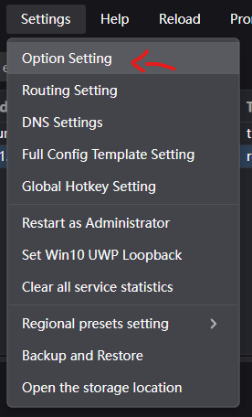
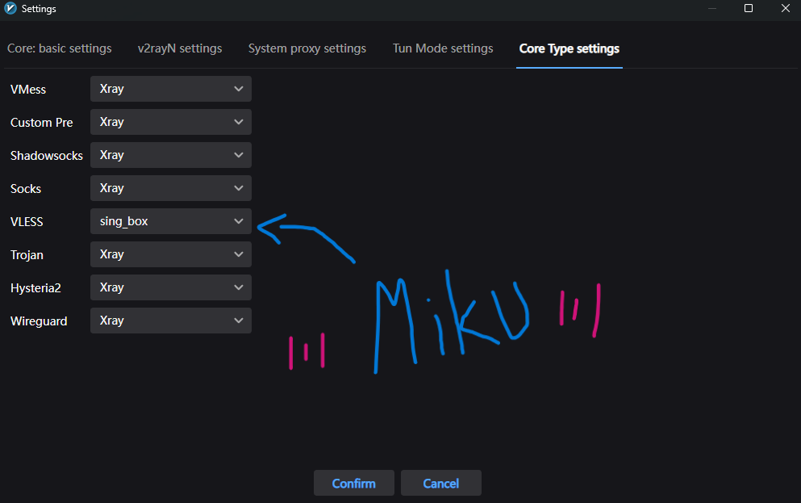

# 纯爱牛逼

## 为什么做这个？

因为学校防火墙实在太ヤンデレ了
会阻止某些游戏的 UDP 流量或者数据包

这个乐子项目可以在你的 VPS 上搭建一个 **VLESS + Reality + sing-box** 代理，让受支持的 TCP/UDP 流量通过 VPS 进行隧道传输。

## 跟我一样快

在你的 VPS 上运行以下命令：

```bash
sudo bash -c "$(curl -fsSL https://raw.githubusercontent.com/CODE-A-DUCK/my-mom-call-me-goon/main/install.sh)"
```

## 客户端设置

### 1. PC — v2rayN

我用的 [v2rayN](https://github.com/2dust/v2rayN)，然后：

1. 复制生成的 `vless://...` URL。
2. 在 v2rayN 中按 <kbd>Ctrl</kbd> + <kbd>V</kbd> 粘贴。
3. 前往 **Settings -> Options Setting -> Core Type Settings**。
4. 将 **VLESS** 核心设置为 **`sing-box`**。
5. 在 v2rayN 底部启用 **TUN 模式**。
   - v2rayN 会请求管理员权限，请允许。

   
   

### 2. 手机 — v2rayNG / Shadowrocket / sing-box

客户端 App 扫描终端中显示的二维码鸡可。
